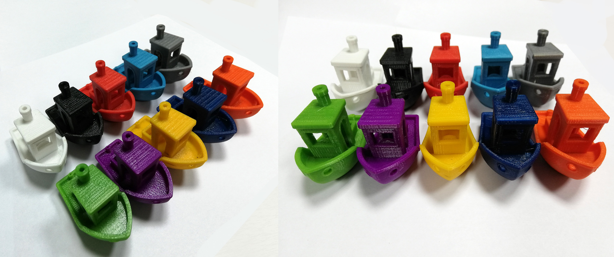

<table class="table-plastik-3d">
	<thead>
		<tr>
			<th colspan="2">Материал</th>
			<th>PETG</th>
		</tr>
	</thead>
	<tbody>
		<tr>
			<td rowspan="2">3D принтер</td>
			<td>Нагреваемый стол</td>
			<td style="text-align: center;">+</td>
		</tr>
		<tr>
			<td>Закрытый корпус</td>
			<td style="text-align: center;">-</td>
		</tr>
		<tr>
			<td colspan="2">Адгезив или материал подложки стола</td>
			<td>Каптон, клей БФ2, чистое стекло</td>
		</tr>
		<tr>
			<td colspan="2">Температура стола,&nbsp;°С</td>
			<td>70</td>
		</tr>
		<tr>
			<td colspan="2">Температура печати,&nbsp;°С</td>
			<td>220–240</td>
		</tr>
		<tr>
			<td colspan="2">Скорость печати,&nbsp;ед.</td>
			<td>30-40 (выше в ущерб качеству печати)</td>
		</tr>
		<tr>
			<td colspan="2">Обдув</td>
			<td>В зависимости от размеров изделия</td>
		</tr>
		<tr>
			<td colspan="2">Межслойная адгезия</td>
			<td>Очень хорошая</td>
		</tr>
		<tr>
			<td colspan="2">Постобработка</td>
			<td>Только механическая</td>
		</tr>
	</tbody>
</table>

                    
Пластик&nbsp;для 3D печати - PETG -&nbsp;&nbsp;сочетает в себе преимущества сразу двух пластиков: ABS и PLA. PETG представляет собой модифицированный полиэтилентерефталат (PET), в отличие от которого пластик обладает некоторыми интересными для 3D печати свойствами. Во первых, это, конечно же, гораздо меньшая температура переработки, чем у обычного PET, позволившая применять данный материал для FDM печати практически на любых принтерах. Во вторых, за счет введения в его содержание гликоля, этот материал не кристаллизуется, за счет чего пластик сохраняет прозрачность.

Минимальная партия: Одна катушка Упаковка: zip пакет, коробка

<h2>Материал:&nbsp;PETG -&nbsp;модифицированный полиэтилентерефталат (PET) 
&nbsp;</h2>

<h2>Параметры печати:</h2>

 
Температура печати: 220-240° С 
Температура стола:&nbsp;70° С 
Покрытие стола, применяемые материалы: каптон, синий скотч, ПВА, клей БФ-2 
Скорость печати:&nbsp;около 50мм/с, возможно увеличение скорости в случае более точного подбора режимов&nbsp;печати. 
Охлаждение:&nbsp;для получения наиболее прочных больших деталей рекомендуем печатать без обдува. Для деталей небольшого размера, а также с целью устранения "паутины" из тянущихся тонких нитей от сопла, можно включать обдув до 100%.

Плотность:&nbsp;1,27 гр/cм3 
Температура кристаллизации:&nbsp;85° С

<h2><strong>Преимущества пластика PETG:</strong></h2>

<ul>
	<li>Высокая химическая стойкость.</li>
	<li>Высокая ударопрочность.</li>
	<li>Исключительно хорошая межслойная адгезия.</li>
	<li>Оптическая прозрачность цветов и глянец на поверхности.</li>
	<li>Простота печати.</li>
	<li>Низкая термоусадка.</li>
	<li>Допуск к контакту&nbsp;с пищей.</li>
	<li>Практически отсутствует запах при печати.</li>
	<li>Подходит для большинства FDM-принтеров.</li>
</ul>

<h2><strong>Недостатки при работе с пластиком&nbsp;PETG:</strong></h2>

<ul>
	<li>Усложненная постобработка изделий из-за высокой химической стойкости.</li>
	<li>Трудноотделяемость поддержек и подложек. Решаема путем резкого охлаждения, например,&nbsp;помещения изделия в снег или морозильник.</li>
</ul>

<strong>&nbsp;</strong>Можно говорить, что пластик PETG сочетает в себе преимущества сразу двух пластиков: ABS и PLA. От ABS - это прочность, долговечность, термостойкость, от PLA — простота использования.

&nbsp;

<h2><strong>Отличия PET </strong><strong>и </strong><strong>PETG</strong></h2>

<strong>PETG </strong>представляет собой модифицированный вариант PET-пластика путем добавления в него при полимеризации гликоля, что придает пластику исключительную прочность.

<strong>PET</strong><strong>-пластик </strong>имеет широкую сферу применения. Наиболее часто встречается в жизни в виде обычных пакетов или пластиковых бутылок для газированных напитков.&nbsp;Применяется для изготовления деталей механизмов, корпусов, изделий медицинского назначения, тары.

<h2><strong>Хранение пластика</strong></h2>

Пластик для 3d&nbsp;печати необходимо хранить в сухом месте. Влага и сырость сильно влияют на филамент, в результате пластик портится, печатать из такого пластика нельзя.

С хранением пластика PETG не возникает проблем, он практически не подвержен воздействию нормальной влажности воздуха окружающей среды. Однако для получения идеального результата печати филамент целесообразно хранить в сухом месте, с силикагелем.

