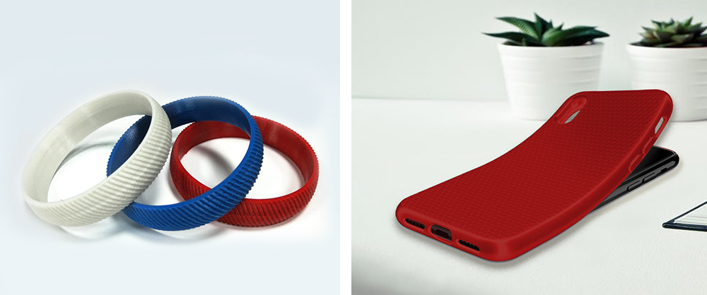

source: https://www.fdplast.ru/plastik-dlya-3d-printera/tpu/

                        <table class="table-plastik-3d">
	<thead>
		<tr>
			<th colspan="2">Материал</th>
			<th>TPU</th>
		</tr>
	</thead>
	<tbody>
		<tr>
			<td rowspan="2">3D принтер</td>
			<td>Нагреваемый стол</td>
			<td style="text-align: center;">+</td>
		</tr>
		<tr>
			<td>Закрытый корпус</td>
			<td style="text-align: center;">-</td>
		</tr>
		<tr>
			<td colspan="2">Адгезив или материал подложки стола</td>
			<td>Клей для 3D печати, клей БФ2, чистое стекло</td>
		</tr>
		<tr>
			<td colspan="2">Температура стола,&nbsp;°С</td>
			<td>50</td>
		</tr>
		<tr>
			<td colspan="2">Температура печати,&nbsp;°С</td>
			<td>175-190</td>
		</tr>
		<tr>
			<td colspan="2">Скорость печати,&nbsp;ед.</td>
			<td>15-20</td>
		</tr>
		<tr>
			<td colspan="2">Обдув</td>
			<td>Эффективный, кольцевой</td>
		</tr>
		<tr>
			<td colspan="2">Межслойная адгезия</td>
			<td>Очень хорошая</td>
		</tr>
		<tr>
			<td colspan="2">Постобработка</td>
			<td>Механическая обработка затруднена. Химическая обработка не применяется</td>
		</tr>
	</tbody>
</table>

Примечание: приведенные параметры печати носят рекомендательный характер. В связи с тем, что на качество печати влияет достаточно большое количество факторов, то зачастую требуется подбор индивидуальных параметров печати. Температуры на 3D принтерах разных моделей могут различаться ввиду неточности показаний термопар. Значительные отличия в параметрах печати для разных цветов одного и того же материала не отмечались.

                    

В 2020 году Московский завод FDplast начал производство нового гибкого пластика для 3D печати - TPU.

Термопластичный полиуретан (TPU) - это современный материал группы полимеров, выполненный на основе сложных полиэфиров.&nbsp;Эластичность напечатанных изделий&nbsp;является основным свойством, которое обуславливает применение этого пластика.

<h4> 
Минимальная&nbsp;партия:&nbsp;Одна катушка 
Упаковка:&nbsp;zip пакет, коробка</h4>

&nbsp;

<h2>Материал:&nbsp;TPU&nbsp;- термопластичный полиуретан 
&nbsp;</h2>

<h2>Параметры печати:</h2>

<strong>Температура печати:</strong>&nbsp;175-190° С

<strong>Температура стола:</strong>&nbsp;50° С

<strong>Покрытие стола:&nbsp;</strong>чистое стекло, клей БФ-2, клей для 3d печати

<strong>Скорость печати:</strong>&nbsp;15-20 мм/с.

<strong>Охлаждение:</strong>&nbsp;рекомендуется печатать используя эффективный, кольцевой обдув.&nbsp;

<strong>Плотность:</strong>&nbsp;1,25&nbsp;г/см3

&nbsp;

<h2><strong>Особенности&nbsp;пластика TPU и работы с ним:</strong></h2>

<ul>
	<li>Эластичность - основное свойство, которое обуславливает применение.</li>
	<li>Высокая стойкость к деформации как на сжатие, так и на растяжение.</li>
	<li>Высокая прочность,&nbsp;очень мягкий. Твердость по Шору 75А</li>
	<li>Отсутствие запаха при печати.</li>
	<li>Отличная межслойная адгезия.</li>
	<li>Низкая скорость печати.</li>
	<li>Стойкость к большинству растворителей, жирам, маслам. Относительная стойкость к бензину.</li>
	<li>Механическая обработка сильно затруднена из-за&nbsp;специфических свойств пластика.</li>
	<li>Широкий диапазон&nbsp;эксплуатационных температур.</li>
	<li>Точность прутка составляет&nbsp;± 0,05 мм (пониженный допуск на геометрию).</li>
	<li>Необходима доработка головки экструдера FDM-принтера с целью устранения зазоров и полостей на пути прутка от подающей шестерни до горячей зоны печатающей головки. Использование экструдеров с боуден трубкой затруднено из-за очень низкой твердости материала.</li>
	<li>Механическая обработка изделий из пластика TPU затруднена.</li>
	<li>Химическая&nbsp;обработка&nbsp;не применяется.&nbsp;</li>
</ul>

&nbsp;

<strong>Термопластичный полиуретан (TPU)</strong> является уникальным материалом, одним из наиболее востребованных полимерных материалов. Эксплуатационные и химические свойства обеспечили этому материалу широкое распространение во всех отраслях промышленности с высокими требованиями к качеству материалов.

<strong>Термопластичный полиуретан (TPU)</strong> объединяет в себе износостойкость, легкость и эластичность,&nbsp;способность не изменять свой цвет в процессе его использования. Материал устойчив к воздействию низких температур. разрыву и агрессивным средам, хорошо сцепляется с поверхностью, восстанавливает форму при деформации, способен прекрасно сопротивляться проколам,&nbsp;обладает сопротивлением к скольжению.

Пластик TPU является первым гибким, Flex-пластиком в линейке пластиков производства Московского завода FDplast.

Обладая прекрасными конструктивными и технологическими свойствами, термопластичный полиуретан используется в различных отраслях, начиная от обмотки силового кабеля,&nbsp;использования в разработке дизайна низа обуви, изготовления защитных аксессуаров для электронных устройств и заканчивая декоративной накладкой в салоне автомобиля.

<h2><strong>Хранение пластика</strong></h2>

Пластик для 3d&nbsp;печати необходимо хранить в сухом месте. Влага и сырость сильно влияют на филамент, в результате пластик портится, печатать из такого пластика становится невозможно. С хранением пластика не возникает проблем, он практически не подвержен воздействию нормальной влажности воздуха окружающей среды. Однако для получения идеального результата печати филамент целесообразно хранить в сухом месте, с силикагелем.

